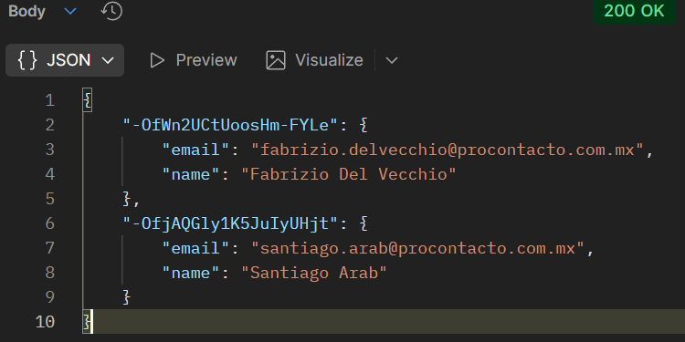
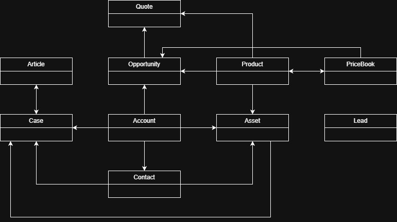

# Evaluación Técnica

## Índice

- [Ejercicio 1 - HTTP básico](#ejercicio-1--http-básico)
  - [1. ¿Qué es un servidor HTTP?](#1-qué-es-un-servidor-http)
  - [2. Verbos HTTP](#2-verbos-http)
  - [3. Request, Response y Headers](#3-request-response-y-headers)
  - [4. QueryString](#4-querystring)
  - [5. Response Codes](#5-response-codes)
  - [6. Envío de datos: GET vs POST](#6-envío-de-datos-get-vs-post)
  - [7. Comportamiento del Navegador](#7-comportamiento-del-navegador)
  - [8. JSON vs XML](#8-json-vs-xml)
  - [9. Estándar SOAP](#9-estándar-soap)
  - [10. Estándar RESTful](#10-estándar-restful)
  - [11. Headers y Content-Type](#11-headers-y-content-type)

- [Ejercicio 3 - Interacción con API REST (Postman)](#ejercicio-3-interacción-con-api-rest-postman)

- [Ejercicio 4 - Módulos de Trailhead](#ejercicio-4-módulos-de-trailhead)

- [Ejercicio 5 - Modelo de Datos de Salesforce](#ejercicio-5--modelo-de-datos-de-salesforce-objetos-estándar-y-relaciones)
  - [1. Lead](#1-lead)
  - [2. Account](#2-account)
  - [3. Contact](#3-contact)
  - [4. Opportunity](#4-opportunity)
  - [5. Product](#5-product)
  - [6. PriceBook](#6-pricebook)
  - [7. Quote](#7-quote)
  - [8. Asset](#8-asset)
  - [9. Case](#9-case)
  - [10. Article](#10-article-knowledge-article)

- [Diagrama de Relaciones](#salesforce-crm--diagrama-de-relaciones-entre-objetos-estándar)

- [Ejercicio 6 - Conceptos Esenciales del Desarrollo en Salesforce](#ejercicio-6--conceptos-esenciales-del-desarrollo-en-salesforce)
  - [Soluciones de Salesforce](#soluciones-de-salesforce)
    - [A. ¿Qué es Salesforce?](#a-qué-es-salesforce)
    - [B. ¿Qué es Sales Cloud?](#b-qué-es-sales-cloud)
    - [C. ¿Qué es Service Cloud?](#c-qué-es-service-cloud)
    - [D. ¿Qué es Health Cloud?](#d-qué-es-health-cloud)
    - [E. ¿Qué es Marketing Cloud?](#e-qué-es-marketing-cloud)
  - [Funcionalidades de Salesforce](#Funcionalidades-de-Salesforce)
    - [A. ¿Qué es un RecordType?](#a-qué-es-un-recordtype)
    - [B. ¿Qué es un ReportType?](#b-qué-es-un-reporttype)
    - [C. ¿Qué es un Page Layout?](#c-qué-es-un-page-layout)
    - [D. ¿Qué es un Compact Layout?](#d-qué-es-un-compact-layout)
    - [E. ¿Qué es un Perfil?](#e-qué-es-un-perfil)
    - [F. ¿Qué es un Rol?](#f-qué-es-un-rol)
    - [G. ¿Qué es un Validation Rule?](#g-qué-es-un-validation-rule)
    - [H. Diferencia entre Master Detail y Lookup](#h-qué-diferencia-hay-entre-una-relación-master-detail-y-lookup)
    - [I. ¿Qué es un Sandbox?](#i-qué-es-un-sandbox)
    - [J. ¿Qué es un ChangeSet?](#j-qué-es-un-changeset)
    - [K. ¿Para qué sirve el Import Wizard?](#k-para-qué-sirve-el-import-wizard)
    - [L. ¿Para qué sirve Web to Lead?](#l-para-qué-sirve-la-funcionalidad-web-to-lead)
    - [M. ¿Para qué sirve Web to Case?](#m-para-qué-sirve-la-funcionalidad-web-to-case)
    - [N. ¿Para qué sirve Omnichannel?](#n-para-qué-sirve-la-funcionalidad-omnichannel)
    - [O. ¿Para qué sirve Chatter?](#o-para-qué-sirve-la-funcionalidad-chatter)
  - [Conceptos generales](#conceptos-generales)
    - [A. ¿Qué significa SaaS?](#a-qué-significa-saas)
    - [B. ¿Salesforce es SaaS?](#b-salesforce-es-saas)
    - [C. ¿Qué significa Cloud?](#c-qué-significa-que-una-solución-sea-cloud)
    - [D. ¿Qué significa On-Premise?](#d-qué-significa-que-una-solución-sea-on-premise)
    - [E. ¿Qué es un pipeline de ventas?](#e-qué-es-un-pipeline-de-ventas)
    - [F. ¿Qué es un funnel de ventas?](#f-qué-es-un-funnel-de-ventas)
    - [G. ¿Qué es Customer Experience?](#g-qué-significa-customer-experience)
    - [H. ¿Qué es omnicanalidad?](#h-qué-significa-omnicanalidad)
    - [I. B2B, B2C y KPI](#i-qué-significa-que-un-negocio-sea-b2bqué-significa-que-un-negocio-sea-b2cqué-es-un-kpi)
    - [J. ¿Qué es una API y qué es una REST API?](#j-qué-es-una-api-y-en-qué-se-diferencia-de-una-rest-api)
    - [K. ¿Qué es un Proceso Batch?](#k-qué-es-un-proceso-batch)
    - [L. ¿Qué es Kanban?](#l-qué-es-kanban)
    - [M. ¿Qué es un ERP?](#m-qué-es-un-erp-enterprise-resource-planning)
    - [N. ¿Salesforce es un ERP?](#n-salesforce-es-un-erp)
- [Ejercicio 7 – Ejercicio de Trigger + Callout (Procontacto)](#ejecicio-7--ejercicio-de-trigger--callout-procontacto)

## Ejercicio 1 – HTTP básico

### 1. ¿Qué es un servidor HTTP?

Un **servidor HTTP** es un software que se ejecuta en una máquina (física o virtual) y que entiende el protocolo de transferencia de hipertexto (HTTP). Su función principal es **escuchar** las peticiones (requests) provenientes de clientes (como navegadores web o aplicaciones móviles) y **responder** entregando los recursos solicitados (archivos HTML, imágenes, datos JSON, etc.) o realizando una acción específica.

Ejemplos populares: *Apache, Nginx, Microsoft IIS.*

---

### 2. Verbos HTTP

Los verbos (o métodos) HTTP indican la **acción** que se desea realizar sobre un recurso identificado. Los más conocidos y utilizados son:

| Verbo | Descripción | Uso común |
| :--- | :--- | :--- |
| **GET** | Solicita una representación del recurso especificado. | Obtener datos. |
| **POST** | Envía datos al servidor para crear un nuevo recurso. | Enviar formularios, crear usuarios. |
| **PUT** | Reemplaza todas las representaciones actuales del recurso de destino con la carga útil de la petición. | Actualizar un registro completo. |
| **PATCH** | Aplica modificaciones parciales a un recurso. | Actualizar solo un campo de un registro. |
| **DELETE** | Borra el recurso especificado. | Eliminar datos. |

---

### 3. Request, Response y Headers

En una comunicación HTTP estándar existe un ciclo de petición y respuesta:

* **Request (Petición):** Es el mensaje que envía el cliente al servidor pidiendo un recurso. Contiene el verbo, la URL, la versión del protocolo, los headers y, opcionalmente, un cuerpo (body).
* **Response (Respuesta):** Es el mensaje que el servidor envía de vuelta. Contiene el código de estado, los headers y, habitualmente, el recurso solicitado en el cuerpo del mensaje.
* **Headers (Encabezados):** Son pares de `clave: valor` que se envían tanto en la petición como en la respuesta. Transmiten **metadatos** o información adicional sobre la comunicación (ej. tipo de navegador, cookies, tipo de contenido, caché).

---

### 4. QueryString

El **QueryString** es una parte de la URL que asigna valores a parámetros específicos. Se ubica después del signo de interrogación `?` y se utiliza para enviar pequeñas cantidades de datos al servidor, generalmente para filtrar o buscar información.

**Estructura:**
`?clave1=valor1&clave2=valor2`

**Ejemplo:**
`https://tienda.com/productos?categoria=zapatos&color=negro`

---

### 5. Response Codes (Códigos de Estado)

El **Response Code** es un número de tres dígitos que el servidor envía para indicar el resultado de la petición. Se agrupan en cinco clases según su primer dígito:

* **1xx (Informativos):** La petición fue recibida y el proceso continúa.
* **2xx (Éxito):** La acción fue recibida, entendida y aceptada correctamente.
    * *Ej: 200 OK, 201 Created.*
* **3xx (Redirección):** Se necesitan acciones adicionales para completar la petición.
    * *Ej: 301 Moved Permanently.*
* **4xx (Error del Cliente):** La petición contiene sintaxis incorrecta o no puede cumplirse.
    * *Ej: 400 Bad Request, 404 Not Found.*
* **5xx (Error del Servidor):** El servidor falló al intentar cumplir una petición aparentemente válida.
    * *Ej: 500 Internal Server Error.*

---

### 6. Envío de datos: GET vs POST

| Característica | Método GET | Método POST |
| :--- | :--- | :--- |
| **Ubicación de datos** | En la URL (QueryString). | En el cuerpo (Body) del mensaje. |
| **Visibilidad** | Visible para todos en la barra de direcciones. | Oculto al usuario promedio (visible en inspección de red). |
| **Límite de tamaño** | Limitado por la longitud máxima de la URL (aprox. 2048 caracteres). | Sin límite teórico (depende de la configuración del servidor). |
| **Uso ideal** | Búsquedas, filtros, lectura de datos. | Envío de contraseñas, subida de archivos, creación de registros. |

---

### 7. Comportamiento del Navegador

Cuando escribimos una URL en la barra de direcciones y presionamos Enter, o cuando hacemos clic en un enlace estándar, el navegador utiliza por defecto el verbo **GET** para solicitar la página web.

---

### 8. Estructuras de Datos: JSON vs XML

Ambos son formatos de texto para el intercambio de datos, pero tienen sintaxis y propósitos ligeramente distintos.

### JSON (JavaScript Object Notation)
Es ligero, fácil de leer por humanos y máquinas, y es el estándar actual para APIs REST y aplicaciones web modernas. Se basa en pares clave-valor.

```json
{
  "usuario": {
    "id": 101,
    "nombre": "Ana García",
    "intereses": ["Programación", "Lectura"],
    "activo": true
  }
}
```
### XML (eXtensible Markup Language)
```xml
<usuario>
  <id>101</id>
  <nombre>Ana García</nombre>
  <intereses>
    <interes>Programación</interes>
    <interes>Lectura</interes>
  </intereses>
  <activo>true</activo>
</usuario>
```
---
### 9. Estándar SOAP

**SOAP (Simple Object Access Protocol)** es un protocolo estricto basado en XML para el intercambio de información estructurada.
* Envelope para encapsular mensajes
* Cabeceras específicas
* Body estructurado
* Reglas estrictas de validación

Habitualmente se describe mediante WSDL y se transporta vía HTTP o SMTP.

---
### 10. Estándar RESTful
**REST (Representational State Transfer)** no es un protocolo, sino un estilo arquitectónico para sistemas distribuidos. Un servicio es "RESTful" cuando cumple con ciertas restricciones, tales como:

* **Cliente-Servidor**: Separación de responsabilidades.
* **Stateless (Sin estado)**: El servidor no guarda el estado del  usuario entre peticiones; cada petición contiene toda la información necesaria.
* **Uso uniforme de la interfaz**: Utiliza los verbos HTTP (GET, POST, PUT, DELETE) de manera semántica para operar sobre recursos.
* **Cacheable**: Las respuestas deben indicar si pueden ser cacheadas.
---
### 11. Headers en un Request y Content-type
Como se mencionó anteriormente, los **headers en un request** brindan contexto al servidor antes de procesar la petición (ej. tokens de autenticación, idioma preferido).

El header `Content-Type` es crucial porque indica al destinatario el **tipo de medio (MIME type)** de los datos que se están enviando en el cuerpo del mensaje.

* **¿Para qué sirve?** Permite que el servidor (o el cliente en la respuesta) sepa cómo interpretar los bits que recibe.

* **Ejemplo**: Si enviamos un JSON, debemos especificar: `Content-Type: application/json` Si no lo hacemos, el servidor podría intentar leerlo como texto plano o fallar al procesarlo.
---

## Ejercicio 3: Interacción con API REST (Postman)

En esta sección se documenta el proceso de pruebas realizado sobre la API de Firebase provista, utilizando Postman para simular el rol de cliente.

---

### 1. Request GET Inicial
**Objetivo:** Consultar el estado actual de la base de datos de contactos.

* **Método:** `GET`
* **URL:** `https://procontacto-reclutamiento-default-rtdb.firebaseio.com/contacts.json`
* **Resultado:** Se obtiene la lista de contactos existentes hasta el momento.

> **Captura de pantalla 1:**
>
> 

---

### 2. Request POST (Creación de recurso)
**Objetivo:** Insertar un nuevo registro en la base de datos.

* **Método:** `POST`
* **URL:** `https://procontacto-reclutamiento-default-rtdb.firebaseio.com/contacts.json`

**Body enviado:**
```json
{
  "name": "Santiago Arab",
  "email": "santiago.arab@procontacto.com.mx"
}
```
---
### 3. Request GET Final y Análisis
**Objetivo:** Verificar la persistencia de los datos enviados.

* **Método:** `GET`
* **URL:** `https://procontacto-reclutamiento-default-rtdb.firebaseio.com/contacts.json`

 **Captura de pantalla 2:**
 

---

**¿Qué diferencias se observan entre las llamadas del punto 1 y 3?**
Al comparar la respuesta del primer `GET` con el último, **se observa la persistencia de los datos**.

En la primera llamada, el listado de contactos no incluía mi registro. Tras ejecutar el método `POST` con el payload JSON (mi nombre y email), el servidor procesó la solicitud y almacenó la información. Por lo tanto, en la tercera llamada (punto 3), el servidor devuelve el listado actualizado incluyendo el nuevo objeto que acabo de crear.

---

## Ejercicio 4: Módulos de Trailhead

Para verificar la resolución de los ejercicios prácticos y los badges obtenidos en la plataforma Trailhead, adjunto el enlace a mi perfil público:

🔗 **[Ver mi Perfil Público de Trailhead](https://www.salesforce.com/trailblazer/yaae93wlwuwn7krm2m)**

---

## Ejercicio 5 – Modelo de Datos de Salesforce (Objetos Estándar y Relaciones)
### 1. **Lead**
**Concepto:**  
Representa un prospecto sin calificar. Es una persona o empresa interesada, pero aún no se determinó si vale la pena seguir el proceso de ventas.

#### *Campos*
*Campos de Información General*
- Name
- FirstName
- LastName
- Salutation
- Title
- GenderIdentity
- Pronouns

*Datos de Empresa*
- Company
- AnnualRevenue
- NumberOfEmployees
- NumberofLocations__c
- SICCode__c
- CompanyDunsNumber
- DandbCompanyId
- Ubicación y Contacto
- Address
- Phone
- MobilePhone
- Fax
- Email
- Website

*Preferencias y Opt-Outs*
- DoNotCall
- HasOptedOutOfEmail
- HasOptedOutOfFax

*Clasificación y Segmentación*
- Industry
- LeadSource
- Status
- Rating
- ProductInterest__c
- Primary__c
- Información Complementaria
- CurrentGenerators__c
- Description

*Datos Administrativos*
- CreatedById
- LastModifiedById
- OwnerId
- IndividualId
- CleanStatus
- Jigsaw
- LastTransferDate

---

### 2. **Account**
**Concepto:**  
Entidad con la que la empresa tiene una relación comercial. Puede ser una empresa (B2B) o un consumidor (B2C).

#### *Campos*
*Identificación y Datos Generales*
- Name
- AccountNumber
- Type
- Ownership
- YearStarted
- Tradestyle
- TickerSymbol
- ParentId
- DandbCompanyId
- DunsNumber
- NaicsCode
- NaicsDesc
- Sic
- SicDesc

*Clasificación, Prioridad y Segmentación*
- AccountSource
- Rating
- CustomerPriority__c
- Active__c
- UpsellOpportunity__c
- SLA__c
- SLAExpirationDate__c
- SLASerialNumber__c
- Tier (Einstein Account Tier)

*Información Comercial*
- AnnualRevenue
- NumberOfEmployees
- NumberofLocations__c
- Direcciones
- BillingAddress
- ShippingAddress
- Match_Billing_Address__c

*Información de Contacto*
- Phone
- Fax
- Website
- Site
- Industria
- Industry
- Descripción
- Description
- Administrativos
- OwnerId
- CreatedById
- LastModifiedById
- CleanStatus
- Jigsaw

---

### 3. **Contact**
**Concepto:**  
Persona asociada a una cuenta (cliente real).

#### *Campos*
*Identificación Personal*
- Name
- FirstName
- LastName
- Salutation
- GenderIdentity
- Pronouns
- Birthdate

*Información Profesional*
- Title
- Department
- Level__c
- BuyerAttributes

*Información de Contacto*
- Phone
- HomePhone
- MobilePhone
- OtherPhone
- Fax
- AssistantName
- AssistantPhone
- Email
- MailingAddress
- OtherAddress
- Preferencias / Opt-Outs
- DoNotCall
- HasOptedOutOfEmail
- HasOptedOutOfFax

*Clasificación / Marketing*
- LeadSource
- ContactSource
- Languages__c
- Prequalified__c
- Loan_Amount__c
- Descripción
- Description

*Campos Administrativos*
- OwnerId
- CreatedById
- LastModifiedById
- LastCURequestDate
- LastCUUpdateDate
- CleanStatus
- Jigsaw
- idprocontacto__c
- IndividualId
- AccountId
- ReportsToId

---

### 4. **Opportunity**
**Concepto:**  
Representa un posible negocio o venta en curso asociada a una Cuenta.

#### *Campos*
*Identificación y Datos Principales*
- Name
- StageName
- CloseDate
- Amount
- Probability
- ExpectedRevenue
- TotalOpportunityQuantity
- Type
- ForecastCategoryName
- IsPrivate

*Información Comercial y de Seguimiento*
- NextStep
- Description
- MainCompetitors__c
- CurrentGenerators__c
- DeliveryInstallationStatus__c
- OrderNumber__c
- TrackingNumber__c
- IqScore
- Origen y Marketing
- LeadSource
- CampaignId

*Relaciones Comerciales*
- AccountId
- ContractId
- Pricebook2Id

*Campos Administrativos*
- OwnerId
- CreatedById
- LastModifiedById

---

### 5. **Product**
**Concepto:**  
Producto o servicio que vende la empresa.

#### *Campos*
*Identificación del Producto*
- Name
- ProductCode
- StockKeepingUnit
- Family
- QuantityUnitOfMeasure

*Información Comercial*
- Description
- DisplayUrl
- ExternalId
- Estado
- IsActive
- Relaciones
- ExternalDataSourceId
- SellerId
- SourceProductId

*Campos Administrativos*
- CreatedById
- LastModifiedById

---

### 6. **PriceBook**
**Concepto:**  
Lista de precios que contiene productos y sus valores asociados.

#### *Campos*
*Identificación*
- Name
- Description

*Estado*
- IsActive
- IsStandard

*Campos Administrativos*
- CreatedById
- LastModifiedById

---

### 7. **Quote**
**Concepto:**  
Presupuesto o cotización formal que se envía a un cliente con precios y productos.

#### *Campos*
*Identificación*
- Name
- QuoteNumber
- Status
- RecordTypeId
- CalculationStatus

*Relaciones*
- AccountId
- QuoteAccountId
- OpportunityId
- ContactId
- ContractId
- BillToContactId
- Pricebook2Id
- RelatedWorkId

*Direcciones – Additional Address*
- AdditionalAddress
- AdditionalName
- AdditionalStreet
- AdditionalCity
- AdditionalState
- AdditionalStateCode
- AdditionalPostalCode
- AdditionalCountry
- AdditionalCountryCode
- AdditionalLatitude
- AdditionalLongitude

*Direcciones – Billing Address*
- BillingAddress
- BillingName
- BillingStreet
- BillingCity
- BillingState
- BillingStateCode
- BillingPostalCode
- BillingCountry
- BillingCountryCode
- BillingLatitude
- BillingLongitude

*Direcciones – Shipping Address*
- ShippingAddress
- ShippingName
- ShippingStreet
- ShippingCity
- ShippingState
- ShippingStateCode
- ShippingPostalCode
- ShippingCountry
- ShippingCountryCode
- ShippingLatitude
- ShippingLongitude
- ShippingHandling

*Direcciones – Quote To Address*
- QuoteToAddress
- QuoteToName
- QuoteToStreet
- QuoteToCity
- QuoteToState
- QuoteToPostalCode
- QuoteToCountry
- QuoteToLatitude
- QuoteToLongitude

*Datos Comerciales*
- ExpirationDate
- Discount
- Subtotal
- Tax
- TotalPrice
- TotalPriceWithTax
- TotalTaxAmount
- GrandTotal
- LineItemCount
- IsSyncing
- CanCreateQuoteLineItems

*Información de Contacto*
- Phone
- Fax
- Email
- Moneda
- CurrencyIsoCode
- Texto y Descripción
- Description
- Auditoría
- LastReferencedDate
- LastViewedDate

---

### 8. **Asset**
**Concepto:**  
Producto físico o servicio adquirido por un cliente. Representa lo que el cliente **ya posee**.

#### *Campos*
*Identificación*
- Name
- SerialNumber
- ExternalIdentifier
- Uuid
- ProductCode

*Relaciones*
- AccountId
- ContactId
- OwnerId
- AssetProvidedById
- AssetServicedById
- LocationId
- ParentId
- RootAssetId
- Product2Id

*Dirección*
- Address

*Datos del Activo*
- AssetLevel
- IsCompetitorProduct
- IsInternal
- HasLifecycleManagement
- Status
- StatusReason
- ProductFamily
- StockKeepingUnit
- ProductDescription

*Fechas y Ciclo de Vida*
- InstallDate
- PurchaseDate
- ManufactureDate
- LifecycleStartDate
- LifecycleEndDate
- CurrentLifecycleEndDate
- UsageEndDate

*Valores y Cantidades*
- Quantity
- CurrentQuantity
- Price
- CurrentAmount
- CurrentMrr
- TotalLifecycleAmount

*Texto y Descripción*
- Description

*Auditoría*
- CreatedById
- LastModifiedById

---

### 9. **Case**
**Concepto:**  
Reclamo o solicitud de servicio del cliente (soporte o atención).

#### *Campos*
*Identificación*
- CaseNumber
- Subject

*Relaciones*
- AccountId
- ContactId
- AssetId
- ProductId
- OwnerId
- ParentId
- EntitlementId
- ServiceContractId
- BusinessHoursId

*Información del Cliente*
- ContactEmail
- ContactPhone
- ContactMobile
- ContactFax
- SuppliedName
- SuppliedEmail
- SuppliedPhone
- SuppliedCompany

*Clasificación del Caso*
- Origin
- Reason
- Type
- Priority
- Status
- Product__c
- PotentialLiability__c
- SLAViolation__c

*Fechas y Tiempos*
- CreatedDate
- ClosedDate
- SlaStartDate
- SlaExitDate
- StopStartDate

*Indicadores y Seguimiento*
- IsClosedOnCreate
- IsEscalated
- IsStopped
- MilestoneStatus

*Texto y Descripción*
- Description
- Comments
- EngineeringReqNumber__c

*Auditoría*
- CreatedById
- LastModifiedById

---

### 10. **Article (Knowledge Article)**
**Concepto:**  
Documento dentro de la Base de Conocimientos de Salesforce (FAQ, instructivos, troubleshooting).

#### *Campos*
*Identificación*
- ArticleNumber
- MasterLanguage

*Publicación*
- FirstPublishedDate
- LastPublishedDate
- ArchivedDate
- ArchivedById
- IsGeneratedByLlm

*Uso y Métricas*
- TotalViewCount
- CaseAssociationCount
- LastViewedDate
- LastReferencedDate

*Migración*
- MigratedToFromArticle

---

### Salesforce CRM — Diagrama de Relaciones entre Objetos Estándar




## Ejercicio 6 – Conceptos Esenciales del Desarrollo en Salesforce

### Soluciones de Salesforce

#### A. ¿Qué es Salesforce?
Es la plataforma de gestión de relaciones con clientes (**CRM**) número uno del mundo basada en **la nube**. Permite a las empresas unificar sus departamentos de marketing, ventas, comercio, servicio y TI en una sola plataforma para tener una visión **360°** de cada cliente y gestionarla desde cualquier lugar.

---

#### B. ¿Qué es Sales Cloud?
Es el módulo de Salesforce diseñado específicamente para la **automatización de la fuerza de ventas (SFA)**. Su objetivo es ayudar a los vendedores a cerrar tratos más rápido mediante la gestión centralizada de leads (candidatos), **oportunidades**, contactos y pronósticos de ventas (Forecasting).

---

#### C. ¿Qué es Service Cloud?
Es la solución enfocada en la **atención y soporte al cliente** (post-venta). Permite a las empresas gestionar incidencias a través de **Casos**, brindar soporte omnicanal (teléfono, chat, email, redes sociales) y ofrecer herramientas de auto-servicio y bases de conocimiento para mejorar la satisfacción del cliente.

---

#### D. ¿Qué es Health Cloud?
Es una solución vertical (específica de industria) diseñada para el sector de **Salud y Ciencias de la Vida**. Extiende el CRM tradicional para gestionar la **relación médico-paciente**, integrando datos clínicos y no clínicos para ofrecer una visión integral del paciente, gestionar planes de cuidado y cumplir con normativas de privacidad sanitaria.

---

#### E. ¿Qué es Marketing Cloud?
Es la plataforma de **marketing digital y automatización** enfocada principalmente en B2C. Permite crear y gestionar campañas personalizadas "1 a 1" a gran escala a través de múltiples canales (correo electrónico, móviles, redes sociales, publicidad web), diseñando recorridos del cliente (**Customer Journeys**) basados en su comportamiento.

---

### Funcionalidades de Salesforce

#### A. ¿Qué es un RecordType? 
Es una configuración que permite diferenciar distintos procesos de negocio para un mismo objeto. Permite asignar diferentes Page Layouts (diseños de página) y diferentes valores en las listas de selección (picklists) según el perfil del usuario o la necesidad del negocio (ej: Lead "Venta Directa" vs. Lead "Partner").

---

#### B. ¿Qué es un ReportType? 
Es una plantilla que define qué objetos y campos están disponibles para crear un reporte. Determina el conjunto de registros base basándose en las relaciones entre objetos (ej: "Cuentas con Contactos" o "Cuentas sin Oportunidades").

---

#### C. ¿Qué es un Page Layout? 
Es la interfaz que controla la disposición visual de un registro. Define qué campos, botones, enlaces personalizados y listas relacionadas son visibles, obligatorios o de solo lectura para el usuario.

---

#### D. ¿Qué es un Compact Layout? 
Controla qué campos clave se muestran en el encabezado (Highlights Panel) de un registro (la parte superior de la página) y en la ventana emergente de vista previa al pasar el mouse sobre un enlace del registro.

---

#### E. ¿Qué es un Perfil?
Define lo que un usuario puede hacer en el sistema. Controla los permisos de objeto (Crear, Leer, Editar, Borrar), permisos del sistema (ej: exportar datos) y la visibilidad de aplicaciones y pestañas. Todo usuario debe tener un perfil obligatorio.

---

#### F. ¿Qué es un Rol?
Define lo que un usuario puede ver (datos) basándose en una jerarquía. Controla la visibilidad de registros: un usuario hereda acceso a los datos de sus subordinados en la jerarquía. A diferencia del perfil, el rol no es obligatorio.

---

#### G. ¿Qué es un Validation Rule?
Es una fórmula lógica que verifica que los datos ingresados cumplan con ciertos estándares antes de guardar el registro. Si la fórmula da como resultado "Verdadero", muestra un mensaje de error y bloquea el guardado.

---

#### H. ¿Qué diferencia hay entre una relación Master Detail y Lookup?

- Lookup (Búsqueda): Es una relación flexible. Los objetos son independientes; si borras el padre, el hijo permanece. La seguridad del hijo es independiente.

- Master-Detail (Maestro-Detalle): Es una relación fuerte. El hijo depende del padre; si borras el padre, se borran los hijos (eliminación en cascada). El hijo hereda la seguridad del padre y permite crear campos de resumen (Roll-up Summary).

---

#### I. ¿Qué es un Sandbox? 
Es una copia del entorno de producción de Salesforce utilizada para desarrollo, pruebas y capacitación. Permite realizar cambios y experimentos sin riesgo de afectar los datos reales ni la operación de la empresa.

---

#### J. ¿Qué es un ChangeSet? 
Es la herramienta nativa para desplegar configuraciones y metadatos (como nuevos campos, perfiles o código Apex) desde una organización de Salesforce a otra conectada (generalmente de un Sandbox a Producción).

---

#### K. ¿Para qué sirve el Import Wizard? 
Es una herramienta sencilla integrada en Salesforce para importar datos (hasta 50.000 registros a la vez) de objetos estándar y personalizados. Permite mapear campos y tiene funciones para evitar duplicados.

---

#### L. ¿Para qué sirve la funcionalidad Web to Lead? 
Genera un formulario HTML para insertar en un sitio web externo corporativo. Cuando un visitante completa el formulario, Salesforce crea automáticamente un registro de Lead (Candidato) en el sistema.

---

#### M. ¿Para qué sirve la funcionalidad Web to Case? 
Similar a la anterior, pero para soporte. Genera un formulario para el sitio web que, al ser completado por un cliente, crea automáticamente un registro de Case (Caso) para que el equipo de atención lo gestione.

---

#### N. ¿Para qué sirve la funcionalidad Omnichannel? 
Es una herramienta de enrutamiento de trabajo. Asigna automáticamente elementos (como Casos, Leads o Chats) a los agentes de soporte disponibles en tiempo real, basándose en su capacidad de carga y sus habilidades (skills).

---

#### O. ¿Para qué sirve la funcionalidad Chatter? 
Es la red social empresarial y herramienta de colaboración integrada en Salesforce. Permite a los usuarios publicar actualizaciones, compartir archivos y comentar directamente sobre registros específicos (como una Oportunidad o Cuenta) para mantener la comunicación contextualizada.

---

### Conceptos generales

#### A. ¿Qué significa SaaS? 
Significa **Software como Servicio**. Es un modelo de distribución de software donde el proveedor aloja la aplicación en sus servidores y el cliente accede a ella a través de Internet (generalmente un navegador web), pagando una suscripción (alquiler) en lugar de comprar una licencia perpetua.

---

#### B. ¿Salesforce es SaaS? 
Sí. Salesforce es el pionero y el ejemplo más famoso de SaaS. No compras el software para instalarlo en tu ordenador; pagas una licencia mensual/anual por usuario para acceder a su plataforma en la nube.

---

#### C. ¿Qué significa que una solución sea Cloud? 
Significa que los recursos informáticos (servidores, almacenamiento, bases de datos) no están físicamente en tu edificio, sino que se accede a ellos bajo demanda a través de Internet. Permite escalabilidad (aumentar potencia fácilmente) y acceso remoto desde cualquier lugar.

---

#### D. ¿Qué significa que una solución sea On-Premise? 
Es lo opuesto a la nube. Significa "**En las instalaciones**" o "En sitio". El software se instala y ejecuta en los servidores y ordenadores físicos de la propia empresa. La empresa es responsable del mantenimiento, seguridad, hardware y actualizaciones.

---

#### E. ¿Qué es un pipeline de ventas? 
Es la representación visual y operativa de todas las **oportunidades de venta abiertas** que un vendedor o empresa está gestionando activamente. Muestra en qué etapa del proceso (Stage) se encuentra cada venta potencial (ej: Prospecto, Negociación, Cierre).

---

#### F. ¿Qué es un funnel de ventas? 
Es un concepto teórico que mide el volumen y la conversión de clientes a través del proceso de venta. Se llama "embudo" porque es ancho arriba (muchos Leads) y estrecho abajo (pocos Clientes). Sirve para analizar **ratios de conversión**: cuántos se pierden en cada paso.

---

#### G. ¿Qué significa Customer Experience? 
La **Experiencia del Cliente** es la suma de todas las interacciones (emocionales, físicas y psicológicas) que un cliente tiene con una marca a lo largo de todo su ciclo de vida, desde el descubrimiento hasta el soporte post-venta.

---

#### H. ¿Qué significa omnicanalidad? 
Es una estrategia que integra todos los canales de comunicación (email, teléfono, chat, tienda física, redes sociales) para ofrecer una experiencia **unificada y coherente**. Si un cliente cambia de canal (ej: de Twitter al teléfono), la conversación continúa sin perder el contexto ni tener que repetir información.

---

#### I. ¿Qué significa que un negocio sea B2B?¿Qué significa que un negocio sea B2C?¿Qué es un KPI?

- **B2B (Business to Business)**: Modelo de negocio donde una empresa vende productos o servicios a otra empresa (ej: Salesforce vendiendo licencias a Coca-Cola).

- **B2C (Business to Consumer)**: Modelo de negocio donde una empresa vende a consumidores finales (ej: Netflix o Spotify vendiendo a una persona).

- **KPI (Key Performance Indicator)**: Indicador Clave de Desempeño. Es una métrica cuantificable que se usa para medir el éxito de un objetivo específico (ej: "Ingresos mensuales", "Tasa de retención de clientes").

---

#### J. ¿Qué es una API y en qué se diferencia de una Rest API?

- **API (Interfaz de Programación de Aplicaciones)**: Es un conjunto de reglas y definiciones que permite que dos softwares diferentes se "hablen" e intercambien datos entre sí.

- **REST API**: Es un tipo específico de API que sigue una arquitectura estándar y ligera basada en el protocolo HTTP (el de la web). Es la más usada hoy en día por ser flexible y fácil de integrar. Salesforce usa API REST para integrarse con webs y apps móviles.

---

#### K. ¿Qué es un Proceso Batch? 
Es el procesamiento de datos por lotes (en grandes volúmenes) de forma asíncrona (no inmediata). Se utiliza para tareas pesadas que no requieren respuesta instantánea, como enviar 1 millón de emails o actualizar precios masivamente durante la noche.

---

#### L. ¿Qué es Kanban? 
Originalmente un método japonés de gestión de flujo de trabajo. En Salesforce, es una **vista visual** de las Oportunidades (u otros objetos) organizadas en columnas según su etapa. Permite mover registros de una etapa a otra "arrastrando y soltando" (drag & drop).

---

#### M. ¿Qué es un ERP? (Enterprise Resource Planning) 
Es un sistema de Planificación de Recursos Empresariales. Gestiona los procesos **Back-Office** de una compañía: contabilidad, finanzas, inventario, logística, recursos humanos y producción. (Ejemplos: SAP, Oracle, Microsoft Dynamics).

---

#### N. ¿Salesforce es un ERP? 
**No, conceptualmente Salesforce es un CRM** (Front-Office: gestión del cliente). Aunque Salesforce tiene capacidades para integrarse con ERPs y gestionar ciertas operaciones, su núcleo es la venta y el servicio, no la contabilidad ni la fabricación. Sin embargo, Salesforce posee una plataforma (AppExchange) donde puedes instalar soluciones que funcionan como ERP (como Rootstock) dentro del ecosistema.

---

## Ejecicio 7 – Ejercicio de Trigger + Callout (Procontacto)

En este ejercicio se desarrolló la integración entre Salesforce y el servicio web de Procontacto para actualizar automáticamente el correo electrónico de un contacto según su idprocontacto.

---

### A. Obtención del ID

Realicé una consulta GET con Postman al endpoint:

`https://procontacto-reclutamiento-default-rtdb.firebaseio.com/contacts.json`

De la respuesta, identifiqué mi ID personal, que luego utilicé para realizar las pruebas del ejercicio.

---

### B. Configuración (Setup)

1. **Campo Personalizado**: Se creó el campo idprocontacto en el objeto Contact (Tipo Texto 255) marcando la casilla de "External ID" (Identificador externo) para indexar las búsquedas.
2. **Remote Site Settings**: Se configuró el sitio remoto en Salesforce para autorizar la salida de tráfico hacia la URL de la **API**.

### C. Desarrollo del trigger y el callout

Se implementó un trigger en Contact que, al crear o modificar un registro donde el campo idprocontacto esté completo, ejecuta un método @future(callout=true) que:

1. Consulta el servicio web:
``https://procontacto-reclutamiento-default-rtdb.firebaseio.com/contacts/{ID}.json``
2. Extrae el email de la respuesta JSON.
3. Actualiza el campo Email del Contact en Salesforce.

Se utilizaron:
* `ContactTrigger.apxt`
* `ContactCalloutClass.apxc`

para manejar el callout Llamada HTTP GET y parseo mediante JSON.deserializeUntyped

---

## D. Pruebas

Para probar la funcionalidad:
* Crear o editar un Contact.
* Completar el campo idprocontacto con el ID obtenido en Postman.
* Guardar el contacto.
* Verificar que el campo Email se complete automáticamente con el valor devuelto por el servicio REST.

---

## E. Código incluido en el repositorio
* Trigger: ContactTrigger.apxt
* Handler con callout: ContactCalloutClass.apxc